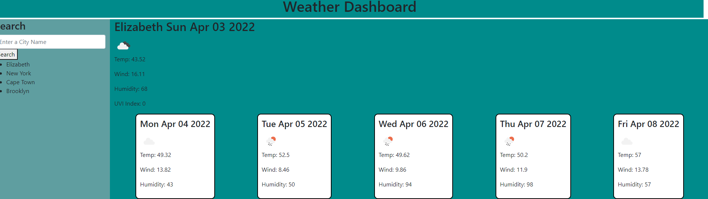

# Weather-Forecast, a Weather Tracking App

## Description:

Using API calls, a user is able to dynamically create and view a webpage which displays the current weather of a city, as well as the 5 day forecast.

## Testing Instructions:

Inputting a city name will bring up the current weather results as well as the 5 day forecast. A users search results are saved in local storage.

## Screenshot of App in use:

## Built With:

- HTML
- CSS
- Javascript
- API fetch requests

## Contribution:

Made with ❤️ by Avrumie Safranovitz
